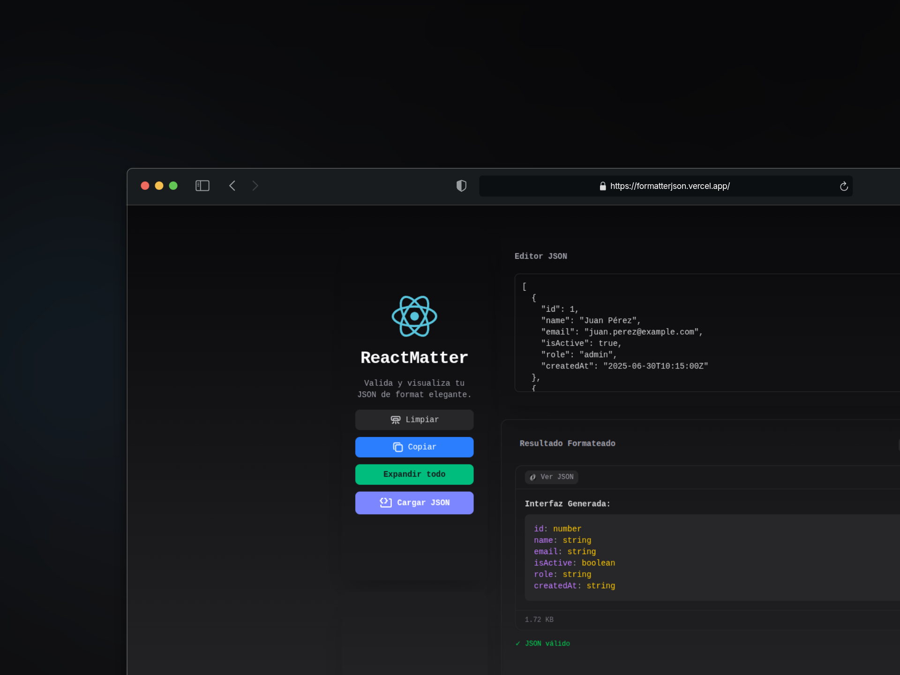

# ReactMatter

ReactMatter es una herramienta sencilla pero poderosa diseñada para formatear JSON y generar interfaces de TypeScript al instante, todo sin necesidad de conectarse a un backend ni hacer consumos externos.
Bajo la filosofía de "lo que es del frontend, se queda en el frontend", ReactMatter apuesta por la eficiencia, rapidez y simplicidad.
¿Qué ofrece ReactMatter?

✨ Formateo de JSON claro, legible y con estilos modernos.
⚙️ Generación automática de interfaces TypeScript basadas en el JSON ingresado.
🧠 Interfaz intuitiva, centrada en la experiencia del desarrollador.
📦 Carga de archivos JSON (funcionalidad en desarrollo).

ReactMatter está construido con React, y su nombre lo dice todo: combina la potencia de React con herramientas que realmente importan para el trabajo diario de los desarrolladores.

💡 Ideal para quienes trabajan con APIs, mockups o estructuras de datos complejas.
