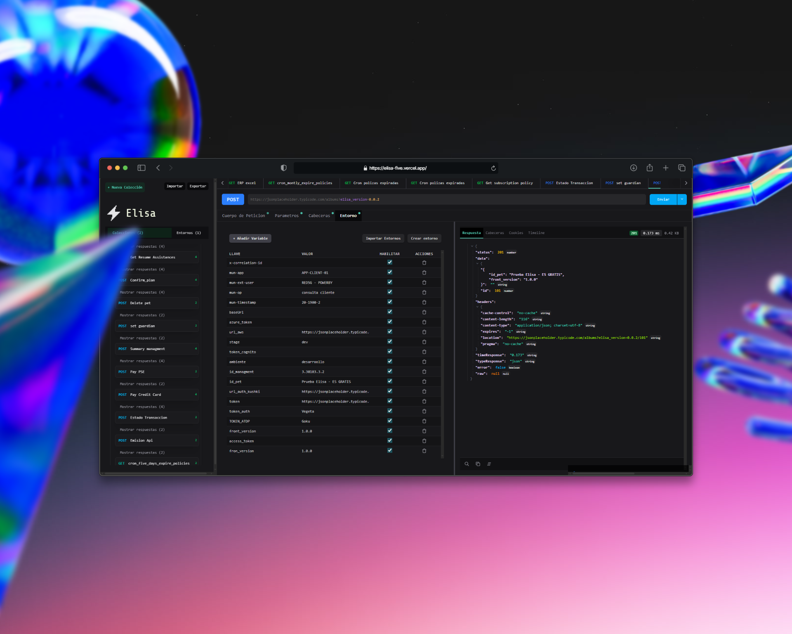

# 
Elisa

Elisa es una herramienta sencilla independiente a jade. pero poderosa y diseñada para ser un client api, la idea es que elisa pueda ser integrado con github como bruno tiene, para asi no tener necesidad de membrasias premiun todo sin necesidad de conectarse a un backend ni hacer consumos externos.
Bajo la filosofía de "lo que es del frontend, se queda en el frontend", ReactMatter apuesta por la eficiencia, rapidez y simplicidad.
## ¿Qué ofrece Elisa?

- ✨ Formateo de JSON claro, legible y con estilos modernos.
- ⚙️ Generación automática de interfaces TypeScript basadas en el JSON ingresado.
- 🧠 Interfaz intuitiva, centrada en la experiencia del desarrollador.
- 📦 Carga de archivos JSON (funcionalidad en desarrollo).

ReactMatter está construido con React, y su nombre lo dice todo: combina la potencia de React con herramientas que realmente importan para el trabajo diario de los desarrolladores.

💡 Ideal para quienes trabajan con APIs, mockups o estructuras de datos complejas.

## Características ⭐

- Formateo de JSON rápido sin uso de back-end
- Minifacion de JSON
- expansión del formateador de JSON
- Interfaz intuitiva
- Comparación de JSON 
- Carga de JSON CON FILE READER
- Compartir URL y JSON por query params (desarrollo)
- Todo en una sola vista
- Rápido y Sencillo

 
