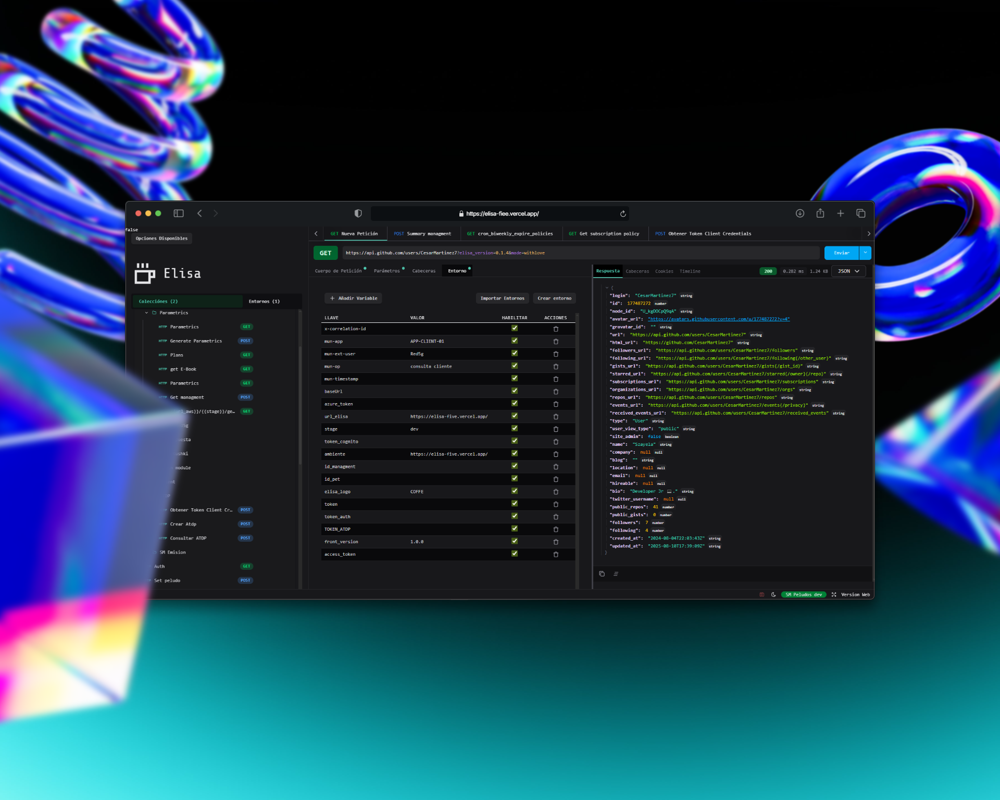

# <p align="center">Elisa Client 0.1.4 </p>

<p align="center"><a href="https://elisaland.vercel.app/" >Pagina web de Elisa</a> </p>

`Elisa` es una herramienta independiente de Jade, sencilla pero poderosa, diseñada para funcionar como un cliente API moderno. Inspirada por la filosofía de `Frontend`, Elisa permite consumir, formatear y trabajar con datos JSON directamente desde el navegador, sin necesidad de backends ni servicios externos.

El objetivo de Elisa es claro: ser una alternativa libre, rápida y potente a herramientas postman, con enfoque en la experiencia del desarrollador y sin sacrificar rendimiento ni simplicidad.


## 🚀 ¿Qué ofrece Elisa?

- ✨ Formateo de JSON claro, legible y con estilos modernos.
- ⚙️ Generación automática de interfaces TypeScript desde JSON.
- 🧠 UI intuitiva centrada en la experiencia del desarrollador.
- 📂 Soporte para carga de archivos JSON (en desarrollo).
- ⚡ Extremadamente rápida y ligera.
- ⭐ Características principales
- ✅ Formateo y minificación de JSON sin necesidad de backend.
- 🔍 Expansión/plegado del visualizador de JSON.
- 🔁 Comparación de JSONs lado a lado.
- 📁 Carga de archivos JSON mediante FileReader.
- 🌐 Compartir JSON a través de parámetros en la URL (en desarrollo).
- 🖥️ Todo en una sola vista, sin cambios de contexto.
- ⚡ Rápido, sencillo y portable.

# 📦 Tecnologías utilizadas

```
React
 TypeScript
   Axios
     Zustand
       Tauri (versión de escritorio)
          Vite
```

# 🧪 Instalación y uso
#### Clonar el repositorio

```bash
git clone https://github.com/CesarMartinez7/elisa.git
cd elisa
```

#### Instalar dependencias
```bash
npm install
```

#### Ejecutar en desarrollo

```bash
npm run dev
```

#### Construir Desktop App

```bash
npm run tauri build
```


# 📄 Licencia

Este proyecto es de código abierto bajo la licencia `CC BY-NC 4.0`.
